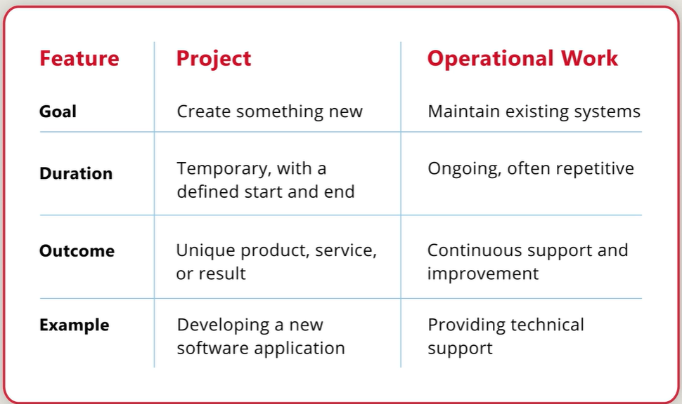
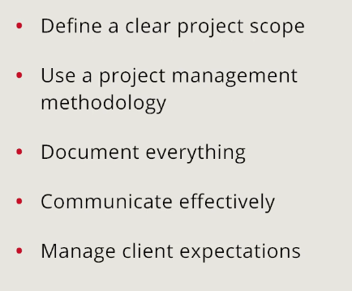
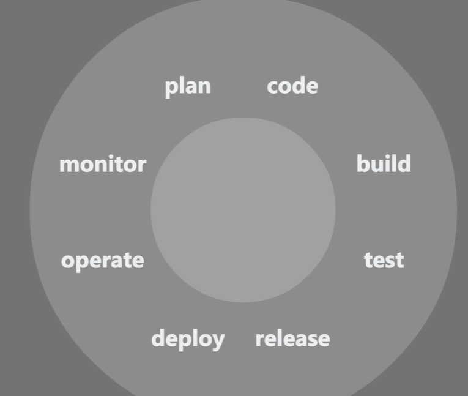

- Week 1
    - What is a Project?
    
        - A project is a temporary endeavor undertaken to create a unique product, service, or result.
        - Projects have a defined beginning and end, specific objectives, and constraints such as time, resources, and scope.

        - Key Characteristics of a Project:
            - Temporary: Projects have a specific start and end date.
            - Unique: Each project creates a unique product or service.
            - Defined Objectives: Projects aim to achieve specific goals.
            - Constraints: Projects operate within limitations such as time, budget, and resources.

        - Operation Work vs. Projects:
            - Operations are ongoing and repetitive, while projects are temporary and unique.
            - Operations focus on maintaining and improving existing processes, while projects aim to create new products or services.

            

        - Project Lifecycle:
            - Initiation: Defining the project and obtaining authorization.
            - Planning: Establishing the scope, objectives, and plan for execution.
            - Execution: Implementing the project plan and delivering the product or service.
            - Monitoring and Controlling: Tracking progress and making adjustments as needed.
            - Closing: Finalizing all activities and formally closing the project.

        - Roles in a Software Team:
            - Project Manager: Oversees the project, manages resources, and ensures objectives are met.
            - Developer: Writes code and implements features.
            - Designer: Creates the user interface and user experience.
            - Tester: Tests the software for bugs and ensures quality.
            - Stakeholder: Provides input and feedback on the project.

            - For more, refer [here](https://www.coursera.org/learn/microsoft-devops-agile-practices-in-python-development/supplement/jWT7V/roles-in-a-software-development-team)

        - Scope Creep:
            - Scope creep refers to the uncontrolled expansion of project scope without adjustments to time, cost, and resources.
            - It can lead to project delays, budget overruns, and failure to meet objectives.
            - To manage scope creep, it's essential to define clear project requirements and change management processes.

            - To prevent scope creep:
                - Clearly define project requirements and objectives.
                - Establish a change management process to evaluate and approve changes.
                - Communicate with stakeholders to manage expectations.
                

        - Avoiding Technical Debt:
            - Technical debt refers to the implied cost of additional rework caused by choosing an easy solution now instead of a better approach that would take longer.
            - It can accumulate over time and lead to increased maintenance costs and reduced software quality.
            - To avoid technical debt, prioritize code quality, conduct regular code reviews, and refactor code when necessary.

            - To avoid technical debt:
                - Write clean, maintainable code.
                - Conduct regular code reviews.
                - Refactor code as needed to improve quality.
                - Refer to [this article](https://www.coursera.org/learn/microsoft-devops-agile-practices-in-python-development/supplement/Wyo9Y/avoiding-technical-debt) for more details.

        - Popular task management tools:
            - Trello: A visual tool for organizing tasks and projects using boards, lists, and cards.
            - Jira: A project management tool designed for agile software development, allowing teams to plan, track, and manage work.
            - Asana: A task management tool that helps teams organize, track, and manage their work.
            - Microsoft To-Do: A task management app that helps users create and manage to-do lists and tasks.
            - Microsoft Planner: A task management tool that allows teams to create plans, assign tasks, and track progress.
            - GitHub Projects: A project management tool integrated with GitHub, allowing teams to organize and track work using issues and pull requests.
            - Microsoft list: A task management app that helps users create and manage lists and tasks.
            - Azure DevOps: A set of development tools for planning, developing, testing, and deploying software, including project management features like boards, backlogs, and sprints.
        - Estimating time and resources for Python tasks:
            - Estimating time and resources for Python tasks involves analyzing the complexity of the task, the skills required, and the available resources.
            - Techniques for estimation include expert judgment, analogy-based estimation, and parametric estimation.
            - It's important to consider potential risks and uncertainties when estimating time and resources.

            - For more details, refer to [this article](https://www.coursera.org/learn/microsoft-devops-agile-practices-in-python-development/supplement/EfTpN/estimating-time-and-resources-for-python-tasks).
        
        - Introduction to Gantt charts:
            - Gantt charts are visual representations of a project schedule, showing tasks, durations, and dependencies.
            - They help teams plan and track progress by providing a clear overview of the project timeline.
            - Gantt charts can be created using various tools, including Microsoft Project, Excel, and online project management software.

            - For more details, refer to [this article](https://www.coursera.org/learn/microsoft-devops-agile-practices-in-python-development/supplement/nK8om/introduction-to-gantt-charts).

- Week 2

    - The DevOps mindset

        - DevOps is a cultural and technical movement that emphasizes collaboration between development and operations teams to deliver software faster and more reliably.
        - Key principles of DevOps include automation, continuous integration and delivery, monitoring, and feedback loops.
        - The DevOps mindset encourages a culture of shared responsibility, where everyone is accountable for the success of the software.

        - For more details, refer to [this article](https://www.coursera.org/learn/microsoft-devops-agile-practices-in-python-development/lecture/K5bgP/the-devops-mindset).

        - 

    - DevOps practices

        - DevOps practices include:
            - Continuous Integration (CI): Automating the integration of code changes into a shared repository.
            - Continuous Delivery (CD): Automating the deployment of code changes to production environments.
            - Infrastructure as Code (IaC): Managing infrastructure using code and automation tools.
            - Monitoring and Logging: Continuously monitoring applications and infrastructure for performance and issues.
            - Collaboration and Communication: Encouraging open communication between development and operations teams.

        - DevOps Tools:
            - Jenkins: An open-source automation server for building, testing, and deploying software.
            - Docker: A platform for developing, shipping, and running applications in containers.
            - Kubernetes: An open-source container orchestration platform for automating deployment, scaling, and management of containerized applications.
            - Azure DevOps: A set of development tools for planning, developing, testing, and deploying software.

        - CI/CD Pipeline:
            - A CI/CD pipeline is a set of automated processes that allow teams to build, test, and deploy code changes quickly and reliably.
            - It typically includes stages for building the code, running tests, deploying to staging environments, and deploying to production.

        - Prometheus and Grafana:
            - Prometheus is an open-source monitoring and alerting toolkit designed for reliability and scalability.
            - Grafana is an open-source analytics and monitoring platform that integrates with Prometheus to visualize metrics and logs.
            - Together, they provide powerful monitoring capabilities for applications and infrastructure.

            - eg:
                - Prometheus collects metrics from applications and infrastructure.
                - Grafana visualizes these metrics in dashboards for real-time monitoring and analysis.
        - Understanding Agile Principles and Values:
            - Agile is an iterative and incremental approach to software development that emphasizes flexibility, collaboration, and customer feedback.
            - Key principles of Agile include delivering working software frequently, welcoming changing requirements, and maintaining a sustainable pace of work.
            - Agile values individuals and interactions over processes and tools, working software over comprehensive documentation, customer collaboration over contract negotiation, and responding to change over following a plan.

        - Agile vs Waterfall:
            - Agile is an iterative approach that allows for flexibility and adaptation to changing requirements, while Waterfall is a linear approach with distinct phases that must be completed before moving to the next.
            - Agile focuses on delivering small increments of working software frequently, while Waterfall delivers the entire product at the end of the project.
            - Agile encourages collaboration and feedback throughout the development process, while Waterfall relies on detailed documentation and upfront planning.

            - Agile is more suitable for projects with changing requirements and uncertainty, while Waterfall is better suited for projects with well-defined requirements and a clear scope.

        - Agile Methodologies:
            - Scrum: An Agile framework that divides work into small, manageable increments called sprints, typically lasting 2-4 weeks. Scrum emphasizes collaboration, accountability, and iterative progress.
            - Kanban: An Agile methodology that visualizes work in progress and limits the amount of work in progress at any given time. Kanban focuses on continuous delivery and flow efficiency.
            - Extreme Programming (XP): An Agile methodology that emphasizes technical excellence, continuous feedback, and customer involvement. XP practices include pair programming, test-driven development, and continuous integration.

            - For more details, refer to [this article](https://www.coursera.org/learn/microsoft-devops-agile-practices-in-python-development/supplement/5jrQv/the-agile-manifesto-a-beginners-guide).  