### JQL Mastery: From Zero to Hero in Jira Query Language

---

## Why Practice JQL?
Practicing JQL does more than help you work faster in Jira. It also:

Sharpens your critical thinking — you learn to break down vague requests into specific search conditions.

Improves your problem-solving — you learn to ask “What am I really looking for?” and how to express that in Jira.

Builds confidence — once you understand how JQL works, you’ll feel more in control of your workflow.

Grows with you — your JQL queries will get smarter as you better understand your project, team needs, and reporting goals.

Common JQL Queries to Start Practicing

1. See all issues in a specific project
`project = "project name"`
Shows all issues in the Maverick project.

2. Find tasks assigned to you
`assignee = currentUser()`
Dynamically shows issues assigned to whoever is viewing the filter.

3. Find issues created this month
`created >= startOfMonth()`
Helpful for reporting or tracking team activity during the current month.

4. Get overdue issues
`due <= now()`
Shows all tasks that are past due, so you can follow up.

5. Find issues with specific statuses
`status in ("To Do", "In Progress")`
Returns tasks that are either open or being worked on.

6. Find high-priority bugs
`issuetype = Bug AND priority = High`
Useful for triaging critical issues quickly.

7. Find issues without an assignee
`assignee is EMPTY`
Great for spotting unassigned work that may fall through the cracks.

8. Filter by open sprint
`sprint in openSprints()`
Used to track what’s currently being worked on in an active sprint.

9. Combine multiple conditions
`project = "project name" AND status = "In Progress" AND priority = Medium`
You’ll often need to layer conditions to focus your search — and this is where JQL really shines.

🛠️ Tips as You Practice
1. Start simple — then build
Don’t aim for the perfect query on your first try. Start with one condition, test it, and add more as needed.

2. Use the autocomplete feature
When typing a field or value, Jira suggests options — this makes writing JQL easier and helps you learn the correct syntax.

3. Use `currentUser()` and date functions
Functions like `currentUser()`, `now()`, `startOfMonth()`, and `endOfWeek()` help you create filters that update dynamically — no manual changes needed.

4. Think like a detective

    - Ask yourself:

        - What am I trying to find?

        - What fields can help me find it?

        - What conditions matter most?

        This kind of structured thinking is a great skill, both inside and outside Jira.

5. Keep experimenting
There’s no “one way” to write JQL. The more you explore, the more shortcuts, functions, and ideas you’ll discover. Over time, you’ll improvise and create smarter queries as your understanding of the project or requirement evolves.
---
##### Key takeaways, notes, and screenshots from the course for future reference.

- 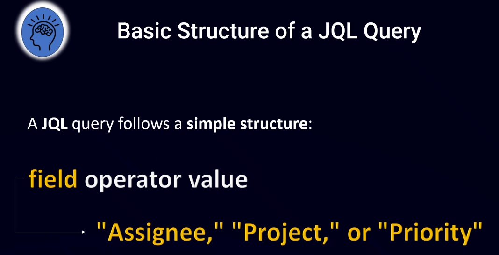{width=60%}

- 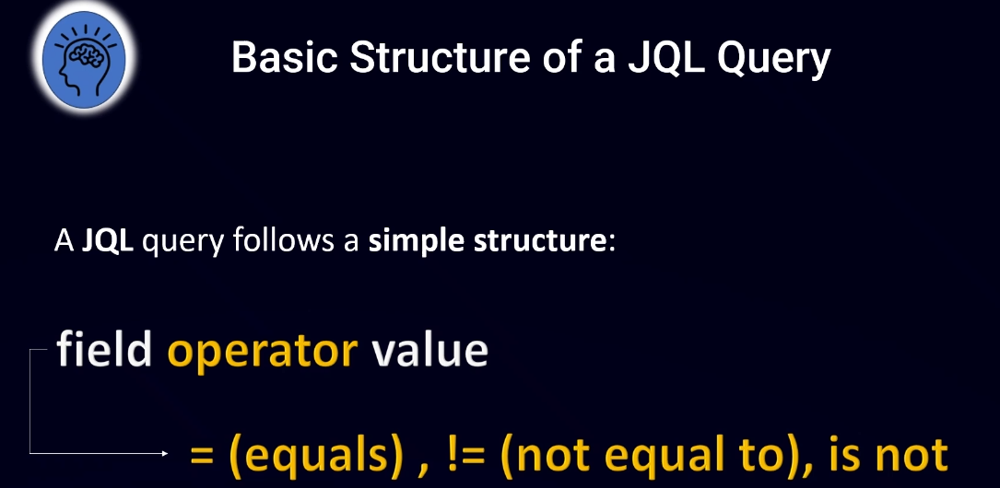{width=60%}

- 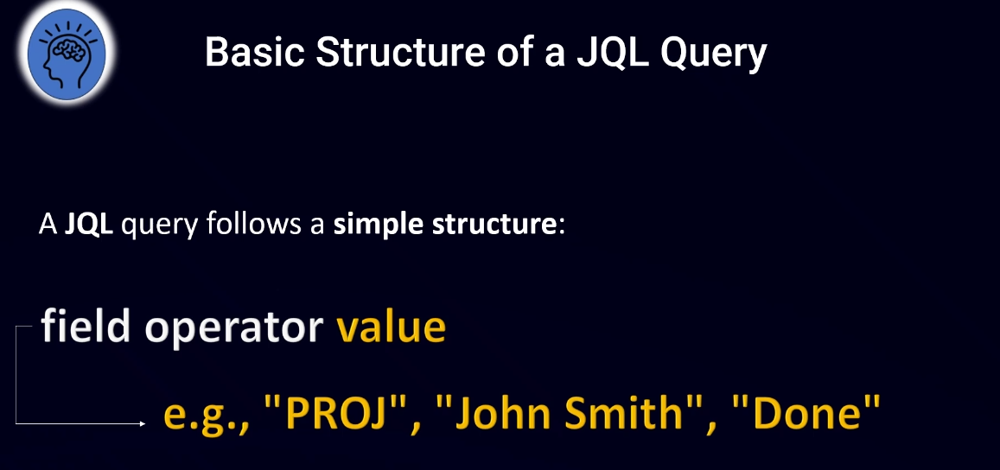{width=60%}

- 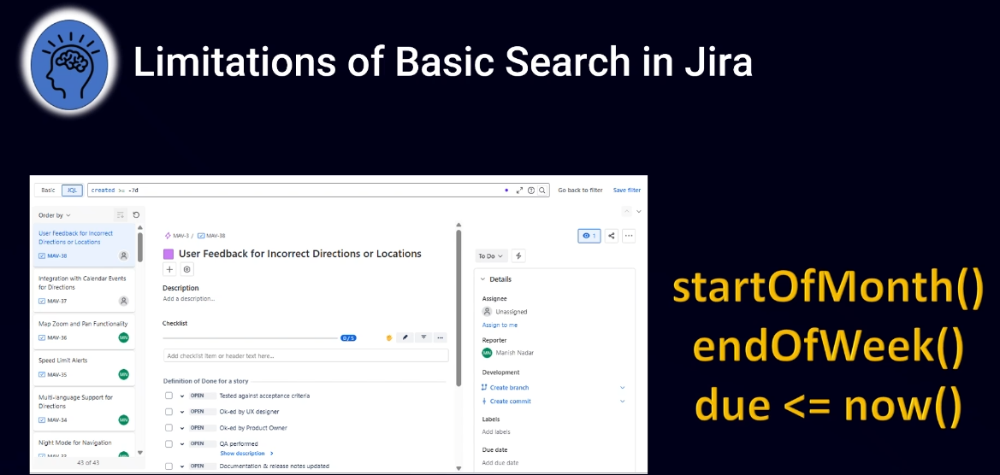{width=60%}

- `assignee = <name> AND due <= now() AND status != Done`

- Creating Custom Fields in Jira - [Refer for more](https://www.udemy.com/course/jql-mastery-from-zero-to-hero-in-jira-query-language/learn/lecture/51654547#overview)

- 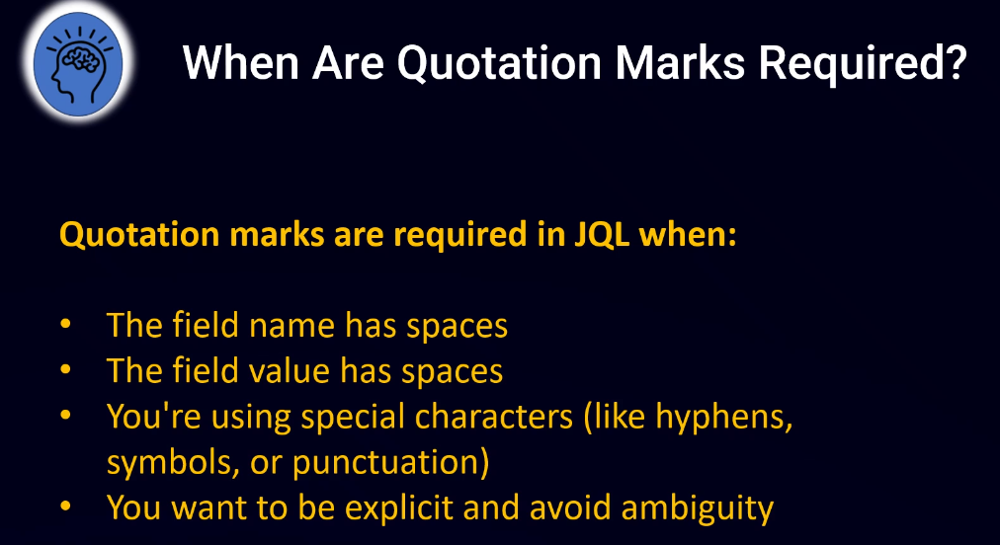{width=60%}

- Master Proper Syntax with 10 Examples [here](https://www.udemy.com/course/jql-mastery-from-zero-to-hero-in-jira-query-language/learn/lecture/51660973#overview)

- 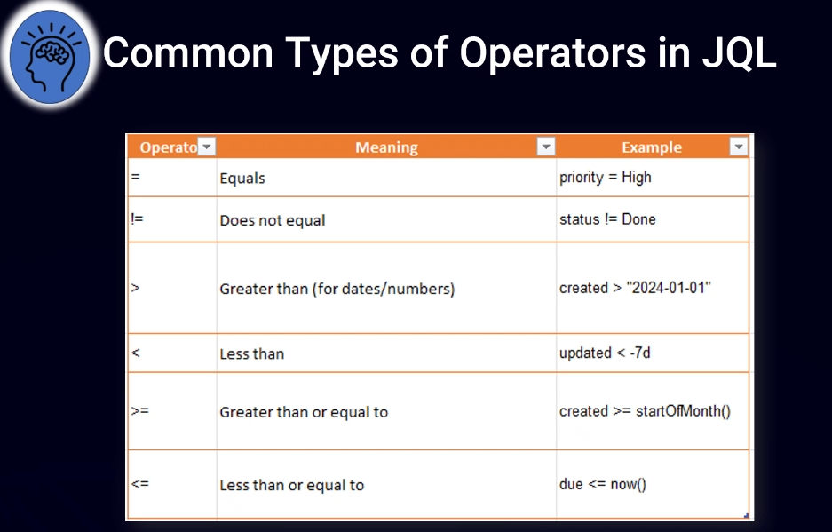{width=60%}

- 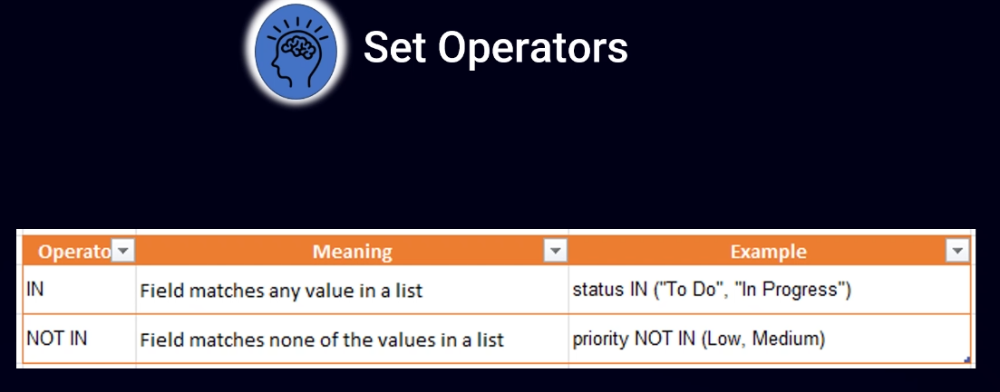{width=60%}

- 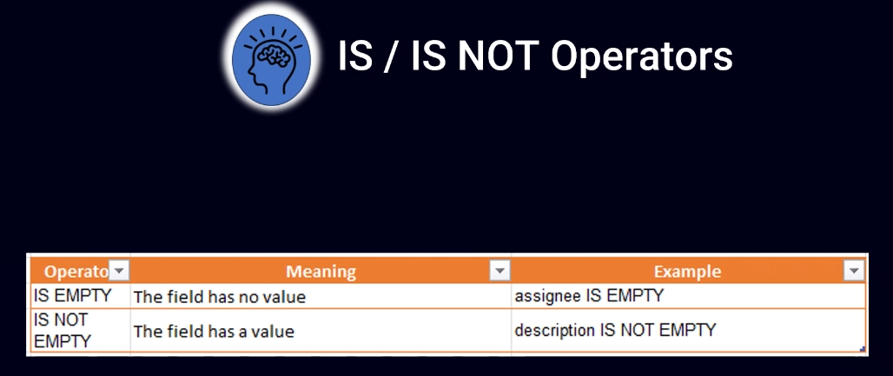{width=60%}

- 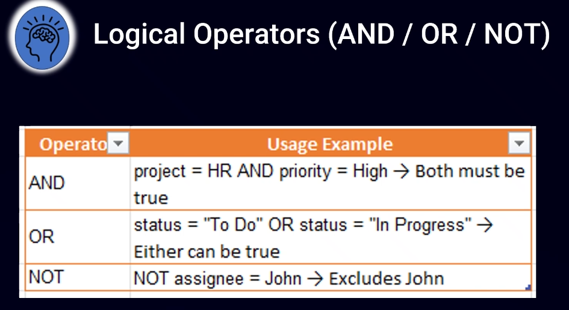{width=60%}

- JQL Operators: 10 Essential Examples for Practice [try me](https://www.udemy.com/course/jql-mastery-from-zero-to-hero-in-jira-query-language/learn/lecture/51661553#overview)

- 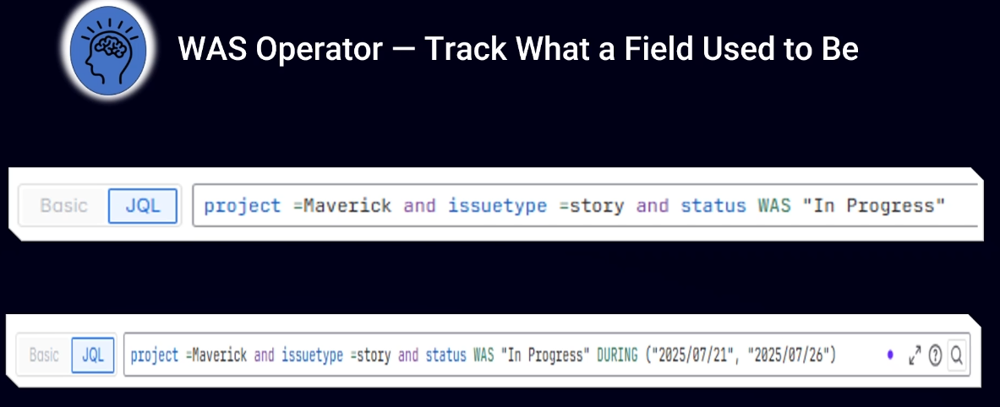{width=60%}

- Historical Operators with 10 Practice Example [here](https://www.udemy.com/course/jql-mastery-from-zero-to-hero-in-jira-query-language/learn/lecture/51668243#overview)

- 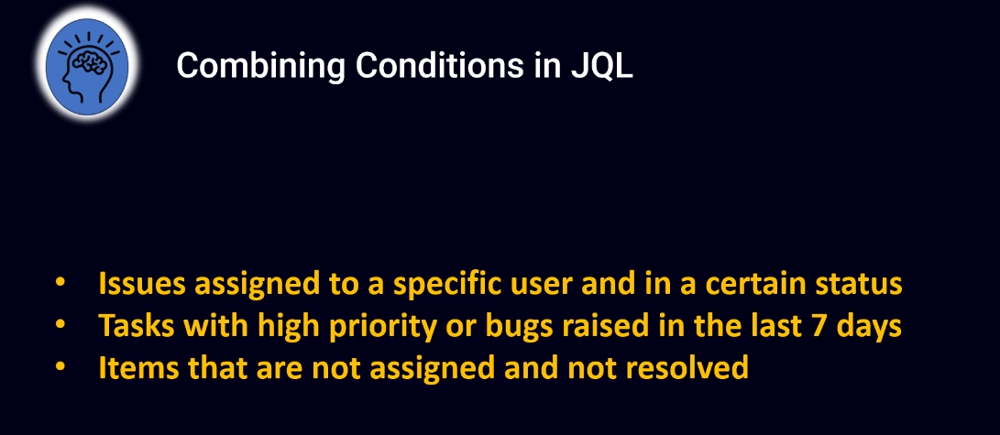{width=60%}

- 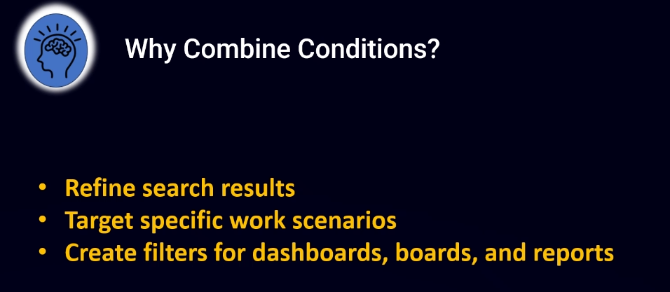{width=60%}

- 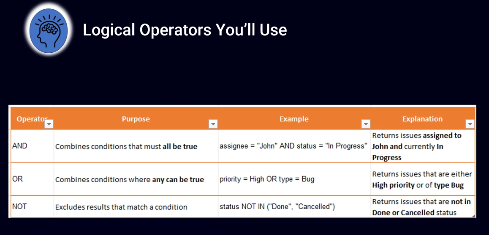{width=60%}

- 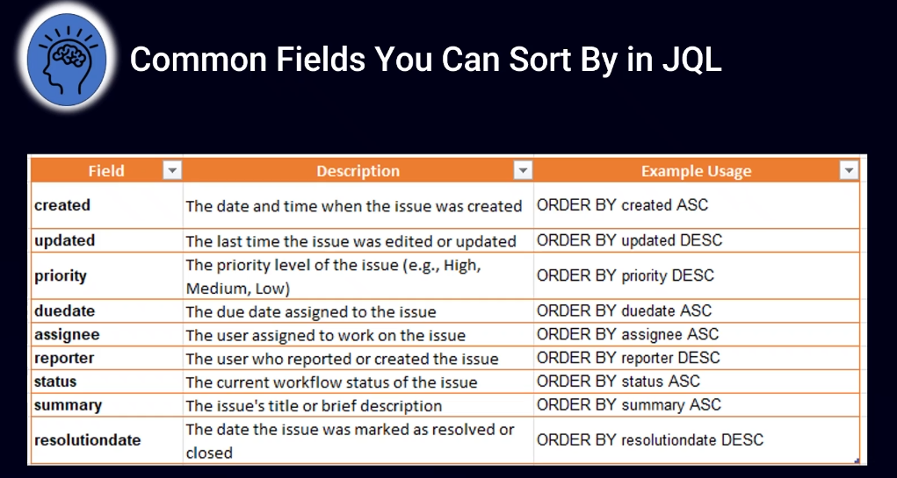{width=60%}

- Sorting: ORDER BY Fundamentals with 10 Essential Examples [here](https://www.udemy.com/course/jql-mastery-from-zero-to-hero-in-jira-query-language/learn/lecture/51669209#overview)

- 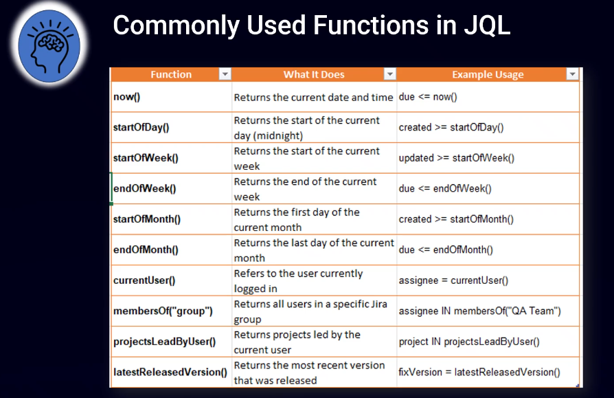{width=60%}

- Essential JQL Functions with Practice Examples [here](https://www.udemy.com/course/jql-mastery-from-zero-to-hero-in-jira-query-language/learn/lecture/51678341#overview)

- 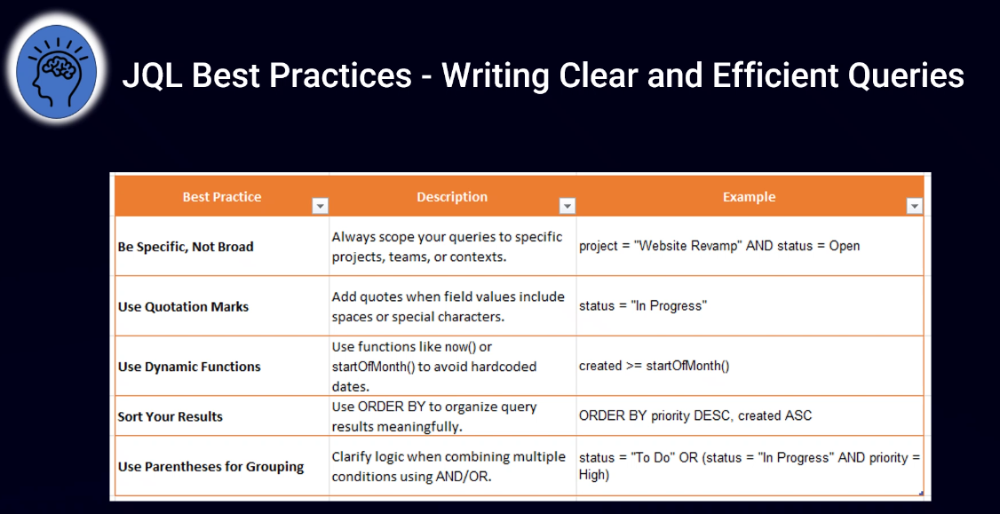{width=60%}

- 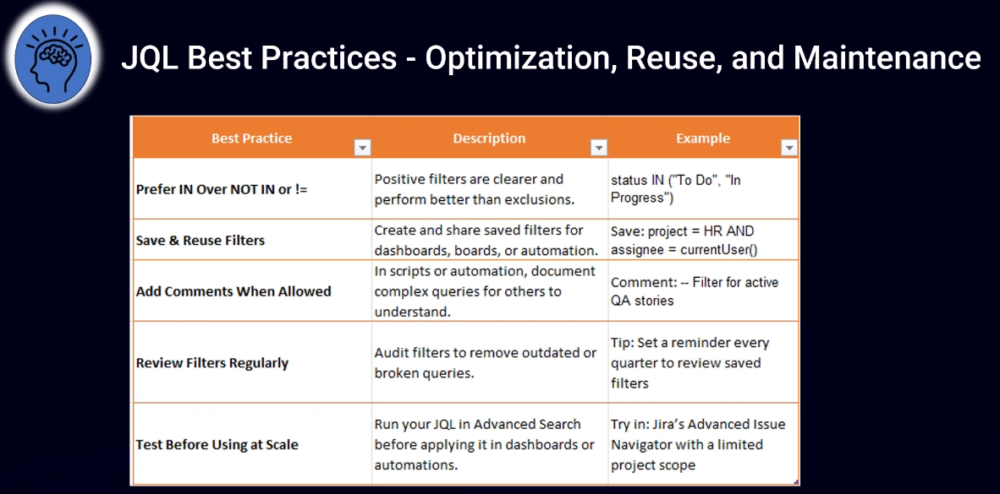{width=60%}

---

- [Certificate](JQL%20Mastery%20From%20Zero%20to%20Hero%20in%20Jira%20Query%20Language.pdf)
