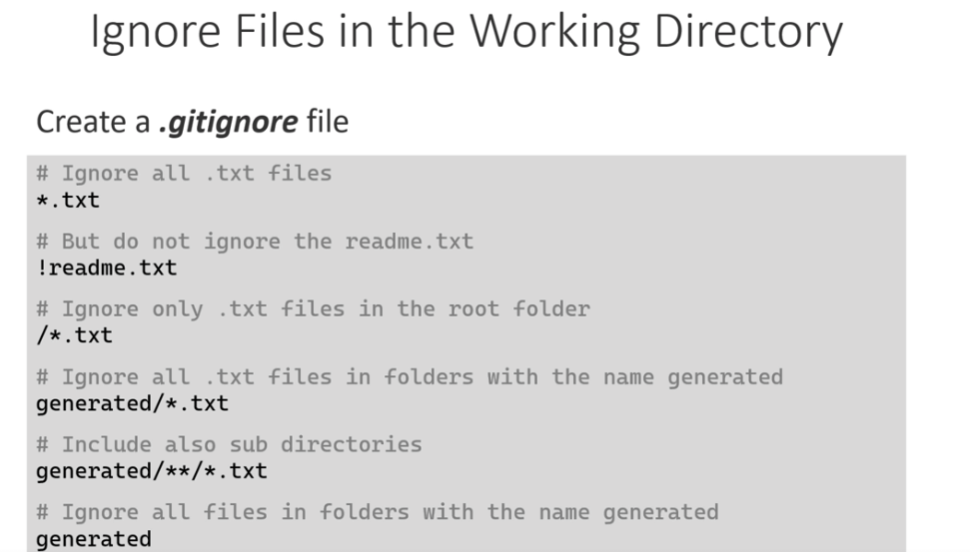

In this section, you installed and configured Git on your machine. To configure Git, you learned about different commands.

You used the following Git commands
Show the version of your Git installation:

git -v

Show the configurations:

git config -l

Configure your username and email:

git config --global user.name "Thomas Claudius Huber"

git config --global user.email "thomas@...com"

The username and email is used by Git for every commit that you will create. Without this configuration, you are not able to commit to a repository.

To show the origin of the configurations, you learned about the --show-origin parameter. It shows you in which file a configuration is located:

git config -l --show-origin

This command above allows you to find the .gitconfig file that is in your user directory. That .gitconfig file contains now the username and the email that you configured.

Now, Git is set up and configured. This means you're ready for some work! :-)

---
In the next section, you will learn how to work with local repositories. But before that, let's test your knowledge with some learning questions.

---
In this section, you created and worked with a local repository.

You used the following Git commands
Initialize an empty Git repository:

git init

Show the status of your repository:

git status

Stage a specific file:

git add readme.txt

Stage all changed files:

git add .

Commit the staged files:

git commit -m "Create readme file"

Define notepad as an editor. It will be used when you run the git commit command without -m parameter:

git config --global core.editor notepad

Show the changes of a specific file:

git diff readme.txt

Show the changes in your working directory:

git diff

Show the changes in your staging area:

git diff --staged

Show the history/log:

git log

Show the history/log with one commit per line:

git log --pretty=oneline

Checkout a specific commit by its snapshot hash:

git checkout b346471

Navigate back to your main branch:

git checkout main

Now you know how to work with a local repository.

In the next section, you will learn how to branch and merge your code. This can be helpful when you want to work on different features in parallel. But before that, let's test your knowledge with some learning questions.

---

In this section, you learned how to branch and merge your code.

You used the following Git commands
List the local branches:

git branch

Create a new branch with the name "feature/AddTwitterHandle":

git branch feature/AddTwitterHandle

Checkout the new branch:

git checkout feature/AddTwitterHandle

Checkout the main branch:

git checkout main

Merge changes from the feature branch into the main branch. This command assumes that you have the main branch checked out:

git merge feature/AddTwitterHandle

Show a graph when showing the history:

git log --pretty=oneline --graph

Now you know how to branch and merge your code, which can be helpful when you want to work on different features in parallel.

In the next section, you will learn how to push your code to a remote repository on GitHub. But before that, let's test your knowledge with some learning questions.

---
In this section, you learned how to push your code to a remote repository on GitHub.

You used the following Git commands
Add the remote repository https://repositoryURL under the name origin to your local repository:

git remote add origin https://repositoryURL

Push the first time to the main branch of the remote repository and set it as upstream:

git push -u origin main

Push the next commits to the remote repository:

git push

Clone a remote repository with the URL https://repositoryURL into a local repository on your machine:

git clone https://repositoryURL

Clone a remote repository into the current directory (Note the separate dot at the end that indicates the current directory):

git clone https://repositoryURL .

Fetch changes from the remote repository without merging them into your local branch:

git fetch

Now you know how to push your code to a remote repository on GitHub, how to clone a remote repository, and how to pull changes from the remote repository into your local repository.

In the next section, you will learn how to create so-called pull requests. But before that, let's test your knowledge with some learning questions.