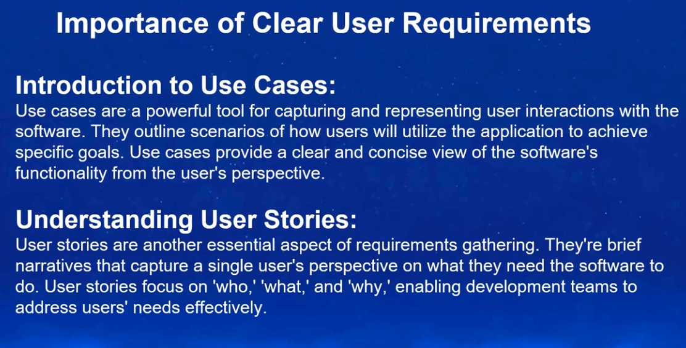
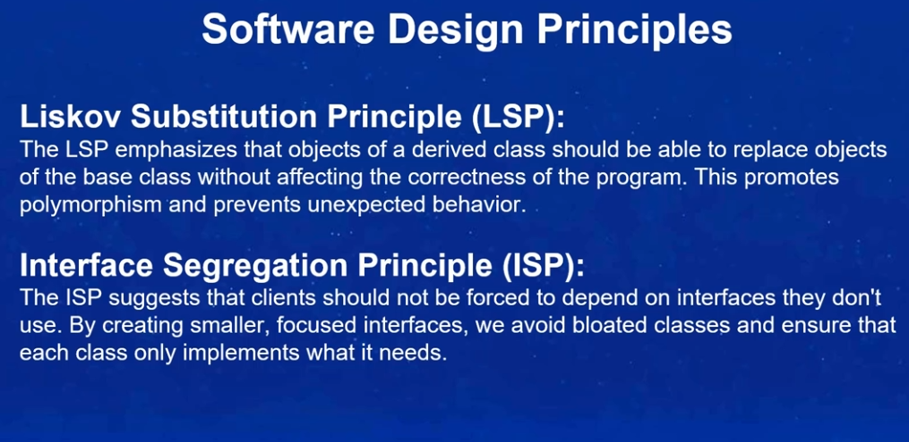

- Course Link : [here](https://www.udemy.com/course/introduction-to-software-engineering)

- Images from Course:

    - Introuction to Software Engineering
        
        - {: width="350" height="200"}

        - {: width="350" height="200"}

        - {: width="350" height="200"}

        - {: width="350" height="200"}

        - {: width="350" height="200"}

        - {: width="350" height="200"}

        - {: width="350" height="200"}

    - Requirments gatherings and Analysis

        - {: width="350" height="200"}

        - {: width="350" height="200"}

        - {: width="350" height="200"}

        - {: width="350" height="200"}

        - {: width="350" height="200"}

    - Design and Architecture

        - {: width="350" height="200"}

        - {: width="350" height="200"}

        - {: width="350" height="200"}

        - {: width="350" height="200"}

        - {: width="350" height="200"}

        - {: width="350" height="200"}

        - {: width="350" height="200"}

    - Implementation and Testing

        - {: width="350" height="200"}

        - {: width="350" height="200"}

        - {: width="350" height="200"}

        - {: width="350" height="200"}

    - Deployment and Maintenance

        - {: width="350" height="200"}

        - {: width="350" height="200"}

        - {: width="350" height="200"}

        - {: width="350" height="200"}

        - {: width="350" height="200"}

        - {: width="350" height="200"}

- Certificate of Completion:

    -  {: width="350" height="200"}

    - pdf can be found in the folder [here](images/introduction-to-software-engineering.pdf)