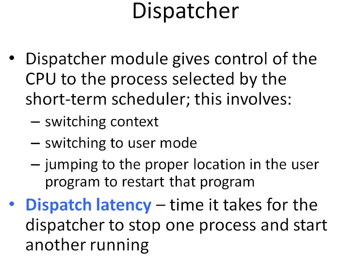
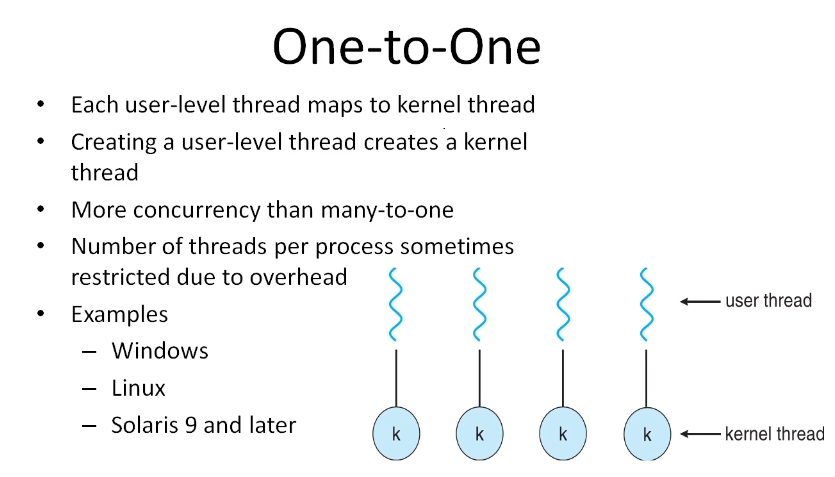

- Course Link: [Udemy - Operating Systems](https://www.udemy.com/course/cpu-scheduling-in-operating-systems/)

- Course Name: Operating Systems

- Notes from Course:

    - Introduction:

        - { width=60% }

        - { width=60% }

        - { width=60% }

        - { width=60% }

        - { width=60% }

        - { width=60% }

        - { width=60% }

        - { width=60% }

        - { width=60% }

        - { width=60% }

        - { width=60% }

        - { width=60% }

    - Process Scheduling:

        - { width=60% }

        - { width=60% }

        - { width=60% }

        - { width=60% }

        - { width=60% }

    - CPU Scheduling:

        - { width=60% }

        - { width=60% }

        - { width=60% }

        - { width=60% }

        - { width=60% }

        - { width=60% }

        - { width=60% }

        - { width=60% }

        - { width=60% }

        - { width=60% }

        - { width=60% }

        - { width=60% }

        - { width=60% }

        - { width=60% }

    - CPU Scheduling Algorithms:

        - { width=60% }

        - { width=60% }

        - { width=60% }

        - { width=60% }

        - { width=60% }

        - { width=60% }

        - { width=60% }

        - { width=60% }

    - Threads

        - { width=60% }

        - { width=60% }

        - { width=60% }

        - { width=60% }

        - { width=60% }

        - { width=60% }

        - { width=60% }

        - { width=60% }

    - Page replacement algorithms:

        - { width=60% }

        - { width=60% }

        - { width=60% }

- No certificate available for this course.