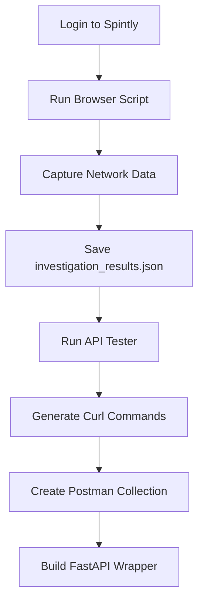

# Spintly Office Access Monitor

## 🎯 Project Overview
This project aims to create a FastAPI webapp that monitors office access history by reverse engineering the Spintly dashboard API. Instead of manually checking the dashboard, you'll have automated access to your office entry/exit data.

## 📁 Project Structure
```
6_Personal/iii_Spintly_hack/
├── README.md                           # This file
├── INVESTIGATION_INSTRUCTIONS.md       # Step-by-step investigation guide
├── browser_investigation_script.js     # Browser console script for API discovery
├── data_collection_template.json       # Template for organizing findings
├── api_tester.py                      # Python script to test discovered APIs
├── investigation_results.json          # Your investigation results (to be created)
├── api_test_results.json              # API testing results (to be created)
├── curl_commands.txt                  # Working curl commands (to be created)
└── postman_collection.json            # Postman collection (to be created)
```

## 🚀 Quick Start

### Phase 1: API Discovery (YOU NEED TO DO THIS)
1. **Follow the investigation guide**: Open `INVESTIGATION_INSTRUCTIONS.md`
2. **Run the browser script**: Use `browser_investigation_script.js` in your browser console
3. **Save the results**: Create `investigation_results.json` with the captured data

### Phase 2: API Testing (AUTOMATED)
```bash
# Install dependencies
pip install requests

# Test discovered APIs
python api_tester.py investigation_results.json
```

### Phase 3: FastAPI Development (NEXT STEP)
Once we have working API endpoints, we'll build the FastAPI webapp.

## 📋 What You Need to Provide

### Required Information:
- [ ] **Spintly login credentials** (keep these secure)
- [ ] **Access to the dashboard**: https://smart-access.spintly.com/dashboard/access/history
- [ ] **Browser with DevTools** (Chrome/Firefox recommended)
- [ ] **15-30 minutes** for the investigation process

### Expected Outputs:
- [ ] **Authentication tokens/cookies** from your session
- [ ] **API endpoints** that load the access history data
- [ ] **Request format** (headers, parameters, etc.)
- [ ] **Response structure** (JSON/HTML format)

## 🔍 Investigation Process

### Step 1: Browser Investigation
```javascript
// You'll run this in browser console:
// 1. Login to Spintly dashboard
// 2. Open DevTools -> Console
// 3. Paste the investigation script
// 4. Follow the prompts
// 5. Save the JSON output
```

### Step 2: API Testing
```bash
# We'll run this together:
python api_tester.py investigation_results.json
```

### Step 3: Create Working Examples
- Generate curl commands
- Create Postman collection
- Test authentication and data retrieval

## 🎯 Expected Outcomes

### What We're Looking For:
1. **Authentication Method**: How to authenticate API requests
2. **Data Endpoint**: URL that returns access history data
3. **Request Format**: Required headers, cookies, parameters
4. **Response Structure**: JSON format of the access data

### Example Target Data:
```json
[
  {
    "name": "Your Name",
    "datetime": "Jul 23, 2025, 08:50:16 AM (IST)",
    "direction": "Entry"
  },
  {
    "name": "Your Name",
    "datetime": "Jul 23, 2025, 06:30:45 PM (IST)",
    "direction": "Exit"
  }
]
```

## 🛠️ Tools Provided

### 1. Browser Investigation Script
- **File**: `browser_investigation_script.js`
- **Purpose**: Capture network requests and authentication data
- **Usage**: Copy-paste into browser console

### 2. API Tester
- **File**: `api_tester.py`
- **Purpose**: Test discovered endpoints programmatically
- **Usage**: `python api_tester.py investigation_results.json`

### 3. Data Templates
- **File**: `data_collection_template.json`
- **Purpose**: Structured format for organizing findings
- **Usage**: Reference for what data to collect

## 🔄 Workflow



## ⚠️ Important Notes

### Security:
- **Never commit credentials** to version control
- **Use environment variables** for sensitive data
- **Test in incognito mode** to verify session requirements

### Rate Limiting:
- **Be respectful** of the Spintly servers
- **Add delays** between requests
- **Monitor for rate limiting** responses

### Legal:
- **Only access your own data**
- **Respect terms of service**
- **Use for personal monitoring only**

## 🆘 Troubleshooting

### Common Issues:
1. **No API calls captured**: Check Network tab manually
2. **Authentication fails**: Verify cookies and tokens
3. **Empty responses**: Check for CSRF protection
4. **Rate limiting**: Add delays between requests

### Getting Help:
1. **Check the logs** in browser console
2. **Review Network tab** in DevTools
3. **Compare with working browser requests**
4. **Test with curl commands** first

## 📞 Next Steps

After completing the investigation:
1. **Review findings together**
2. **Create working API calls**
3. **Build FastAPI application**
4. **Add monitoring features**
5. **Deploy the solution**

## 🎉 Success Criteria

We'll know we're successful when we can:
- [ ] **Authenticate** programmatically with Spintly
- [ ] **Fetch access history** via API calls
- [ ] **Parse the data** into structured format
- [ ] **Create automated monitoring** system

---

**Ready to start?** Open `INVESTIGATION_INSTRUCTIONS.md` and let's discover those APIs! 🕵️‍♂️