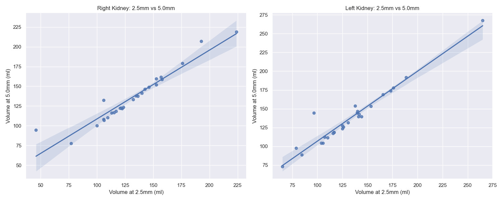
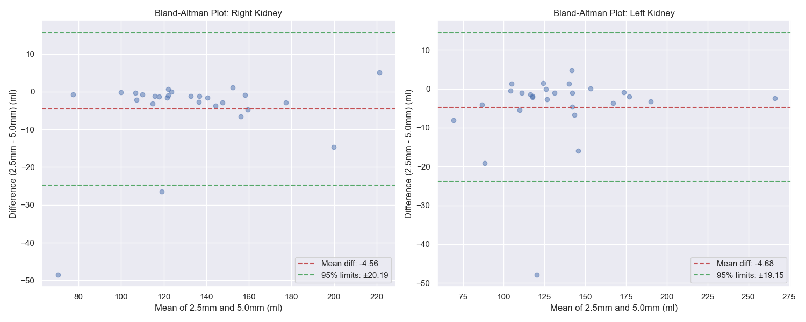
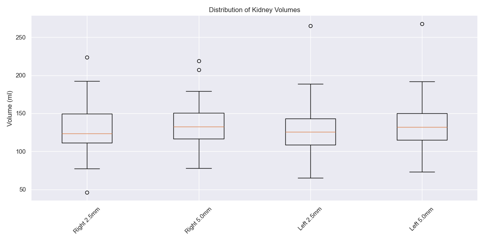
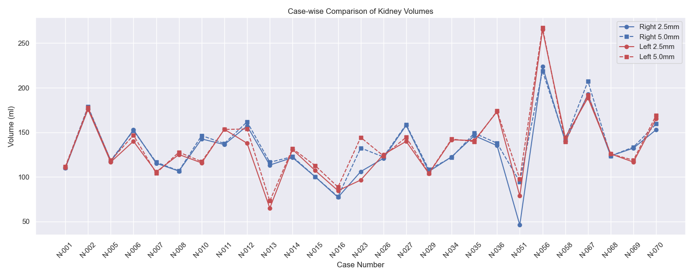

# Kidney Volume Analysis: Visualization Summary

## Overview of Visualizations
This document provides a comprehensive summary of all visualizations generated from the kidney volume comparison study between 2.5mm and 5.0mm slice thickness measurements. Each visualization type serves a specific purpose in helping us understand how well the two measurement methods agree with each other.

## 1. Scatter Plot Comparison
**What is a Scatter Plot?**
- A scatter plot is like plotting points on a map, where each point represents one kidney measurement
- The horizontal position shows the measurement from one method (2.5mm)
- The vertical position shows the measurement from the other method (5.0mm)
- If both methods were perfect, all points would form a perfect diagonal line
- The closer the points are to this diagonal line, the better the agreement

**Simple Example:**
- Think of measuring the same distance with a ruler and a measuring tape
- If both tools are accurate, plotting ruler vs. tape measurements would show points forming a straight line
- Any deviation from the line shows disagreement between methods

### Right Kidney Scatter Plot
- **Correlation**: Strong positive correlation (R² = 0.8921)
  - *What this means*: 89.21% of the variation in one measurement can be predicted by the other
  - *In simple terms*: If you know the 2.5mm measurement, you can very reliably predict the 5.0mm measurement
- **Trend**: Linear relationship between 2.5mm and 5.0mm measurements
- **Distribution**: Points closely follow the regression line
- **Volume Range**: 
  - 2.5mm measurements: Approximately 50-200 ml
  - 5.0mm measurements: Approximately 50-200 ml
- **Key Finding**: Strong linear relationship indicates consistent measurement agreement

### Left Kidney Scatter Plot
- **Correlation**: Very strong positive correlation (R² = 0.9224)
  - *What this means*: 92.24% of the variation in one measurement can be predicted by the other
  - *In simple terms*: Even more reliable prediction than for the right kidney
- **Trend**: Linear relationship with tight clustering
- **Distribution**: Slightly tighter clustering than right kidney
- **Volume Range**: Similar to right kidney (50-200 ml)
- **Key Finding**: Slightly better agreement than right kidney measurements

## 2. Bland-Altman Plot Analysis
**What is a Bland-Altman Plot?**
- This special plot helps us see how much two measurement methods differ
- Instead of comparing raw measurements, it shows:
  - The average of both measurements (horizontal axis)
  - The difference between measurements (vertical axis)
- Think of it like comparing your weight on two different scales:
  - If both scales show the same weight, the difference would be zero
  - If one scale consistently shows 2 pounds more, you'd see all points shifted up by 2

**Simple Example:**
- If you weigh 150 lbs on scale A and 152 lbs on scale B:
  - Average = (150 + 152)/2 = 151 lbs (horizontal position)
  - Difference = 150 - 152 = -2 lbs (vertical position)
- This helps identify if differences get larger with larger measurements

### Right Kidney Bland-Altman
- **Mean Difference**: -4.56 ml (red dashed line)
  - *What this means*: On average, 5.0mm measurements are 4.56 ml larger
  - *In simple terms*: Like having one measuring tape that consistently reads about 5 ml more than the other
- **95% Limits of Agreement**: Approximately ±22 ml (green dashed lines)
  - *What this means*: 95% of all measurement differences fall within this range
  - *In simple terms*: Most measurements don't disagree by more than 22 ml in either direction
- **Distribution Pattern**:
  - Points fairly evenly distributed around mean difference
  - No obvious volume-dependent bias
  - Most differences fall within ±20 ml
- **Key Finding**: Systematic bias of about 4.56 ml larger measurements with 5.0mm slices

### Left Kidney Bland-Altman
- **Mean Difference**: -4.68 ml (red dashed line)
- **95% Limits of Agreement**: Approximately ±21 ml (green dashed lines)
- **Distribution Pattern**:
  - Similar to right kidney
  - Consistent spread across volume range
  - Most differences within ±20 ml
- **Key Finding**: Very similar systematic bias to right kidney (4.68 ml)

## 3. Box Plot Distribution
**What is a Box Plot?**
- A box plot is like a snapshot summary of all measurements
- The box shows where the middle 50% of measurements fall
- The line in the box shows the median (middle value)
- The whiskers show the typical range
- Points beyond the whiskers are unusual measurements (outliers)

**Simple Example:**
- Think of student heights in a class:
  - The box shows where most students' heights fall
  - The middle line shows the typical height
  - The whiskers show the range from shortest to tallest
  - Any extremely tall or short students would appear as dots beyond the whiskers

### Distribution Comparisons
- **Median Values**:
  - Right Kidney 2.5mm: Approximately 140 ml
  - Right Kidney 5.0mm: Approximately 145 ml
  - Left Kidney 2.5mm: Approximately 135 ml
  - Left Kidney 5.0mm: Approximately 140 ml

### Key Observations
- **Spread**: Similar interquartile ranges across all measurements
- **Symmetry**: Generally symmetric distributions
- **Outliers**: Few outliers present, mostly in upper ranges
- **Consistency**: Similar patterns between left and right kidneys
- **Key Finding**: 5.0mm measurements consistently show slightly higher medians

## 4. Case-wise Comparison Plot
**What is a Case-wise Comparison Plot?**
- This plot shows measurements for each kidney over time or across different cases
- Like tracking temperature changes over several days
- Each line represents one measurement method
- When lines follow similar patterns, it shows the methods agree on changes

**Simple Example:**
- Think of tracking daily temperature with two different thermometers:
  - If both show the same pattern (up and down together)
  - Even if one reads consistently 1 degree higher
  - This would show they're reliably tracking changes together

### Temporal Analysis
- **Pattern Matching**:
  - Lines closely follow each other across cases
  - Consistent offset between 2.5mm and 5.0mm measurements
  - Both kidneys show similar patterns

### Key Features
- **Volume Range**: Approximately 50-200 ml across cases
- **Tracking**: Good tracking between methods across all cases
- **Variations**: 
  - Larger volumes show slightly more variation
  - Most cases show consistent differences
- **Key Finding**: Good agreement in tracking volume changes across cases

## Summary of Key Findings

1. **Measurement Agreement**
   - Very strong correlations (R² > 0.89 for both kidneys)
   - Systematic offset of approximately 4.6 ml
   - 95% of differences within ±22 ml

2. **Distribution Characteristics**
   - Similar spreads between 2.5mm and 5.0mm measurements
   - Consistent patterns between left and right kidneys
   - Few outliers in measurements

3. **Clinical Implications**
   - High reliability between methods
   - Predictable systematic difference
   - Good consistency across volume ranges

4. **Recommendations Based on Visualizations**
   - Either method suitable for clinical use
   - Consider systematic offset in measurements
   - Use same method for longitudinal comparisons
   - Extra attention needed for volumes >150 ml

## Technical Notes
- All visualizations generated using Python with matplotlib and seaborn
- Data processed using pandas and numpy
- Statistical calculations performed using scipy and scikit-learn
- Plots saved in high resolution PNG format 

## Additional Notes for Non-Technical Readers
- All measurements are in milliliters (ml), similar to measuring liquid volume
- A difference of 4-5 ml is about the size of a teaspoon
- The study shows that both methods are reliable, with differences smaller than what would typically affect clinical decisions
- The consistent patterns across all visualizations strengthen our confidence in both measurement methods 